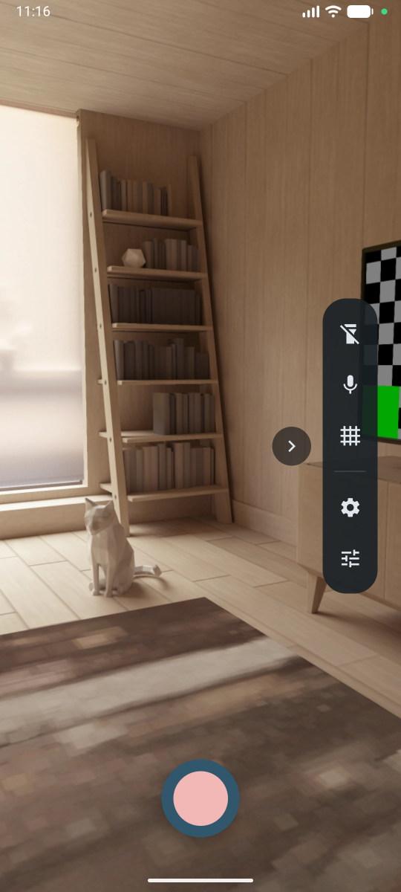
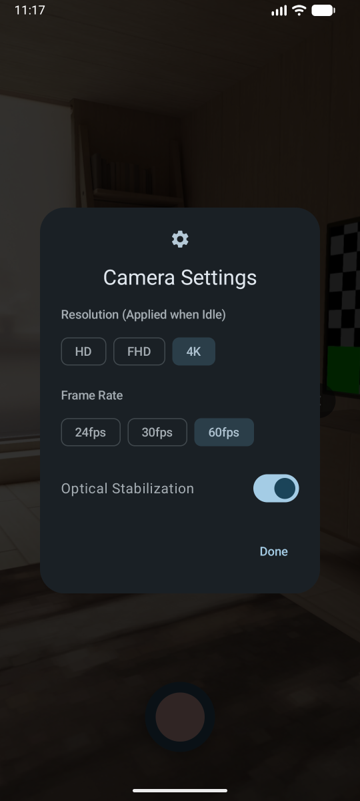
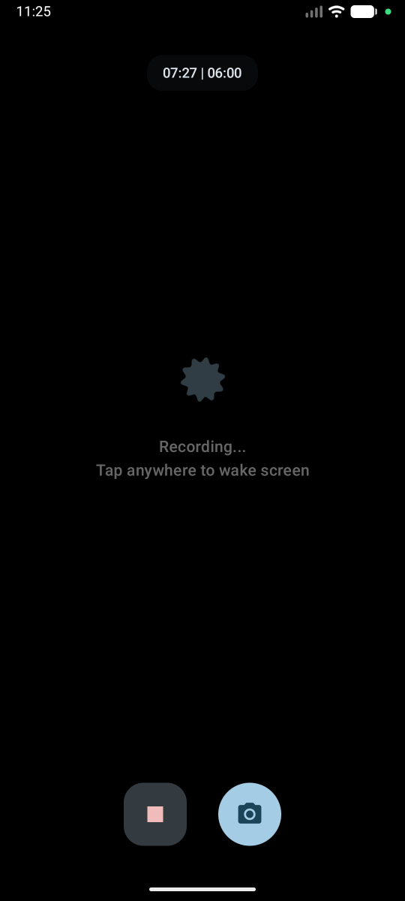
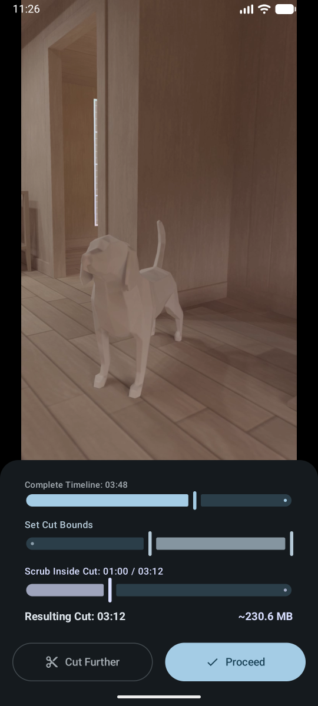

# ATROPOS
**Open-source continuous rolling-buffer camera for Android**

> [!NOTE]  
> **Provisional Alpha Release (v0.0.3)**
> 
> Atropos is currently in an early **PoC Alpha** stage. This README is provisional and will expand as the project grows. While the core rolling-buffer pipeline and video cutting features are functional, please review the [Known Issues](#known-issues) before use. 
>
> **Development Lifecycle:** Following the upcoming minor release (`v0.1.0`), development will transition to a standard Gitflow workflow. New features will be pushed to the `dev` branch and routinely merged into `master`. Signed release APKs will also become available at that time (currently only Debug builds are provided).

[](https://github.com/Animesh-Varma/Atropos/releases)
[](https://github.com/Animesh-Varma/Atropos/blob/master/LICENSE)

In Greek mythology, Atropos is the Fate who cuts the thread of time!

Atropos is a continuous recording app designed to act like a personal dashcam for everyday use. Once started, it records video continuously in the background, saving it into a rolling buffer. When the buffer is full, the oldest footage is seamlessly overwritten by the newest! You never miss a moment, and you never fill up your phone's storage with gigabytes of dead footage! 

When something interesting happens, simply stop the recording, cut your desired clip from the buffer, and save it!

---

## Downloads

*Note: Atropos is not yet available on any distribution stores (Google Play, F-Droid, IzzyOnDroid). Currently, only pre-release Debug APKs are available via GitHub.*

<div align="left">
  <a href="https://github.com/Animesh-Varma/Atropos/releases">
    
  </a>
</div>

---

<h3 align="center">Contents</h2>

<p align="center">
  <a href="#features">Features</a> •
  <a href="#how-it-works">How It Works</a> •
  <a href="#screenshots">Screenshots</a> •
  <a href="#known-issues">Known Issues</a>
  <br>
  <a href="#roadmap">Roadmap</a> •
  <a href="#technical-stack">Tech Stack</a> •
  <a href="#build-instructions">Build</a> •
  <a href="#contact">Contact</a>
</p>

---

## Features

- **Gapless Rolling Buffer:** Records continuously in sequential chunks. The app quietly deletes older segments as new ones are created, ensuring you only ever keep the last few minutes of action.
- **Eco-Mode:** Video recording is a battery-heavy task. To mitigate this, Atropos automatically unbinds the screen preview after 1 minute of inactivity, plunging the screen into a true-black OLED power-saving mode while the camera continues to record in the background. 
- **Built-in Editor & Cutter:** Scrub through your recent buffer using a custom ExoPlayer-powered multi-slider. Isolate the exact moment you want to keep, and export it instantly.
- **Advanced Camera Controls:** Features native hardware OIS (Optical Image Stabilization) forcing, 10-bit HDR video toggles, and dynamic target FPS/Resolution settings. 
- **Material 3 Interface:** Features a sleek side-drawer for quick toggles (torch, dynamic mic mute, rule-of-thirds grid), pinch-to-zoom with a fading pill overlay, and tap-to-focus with auto-exposure reset.

---

## How It Works

### **The Buffer Logic**
To provide a perfectly seamless editing experience, Atropos records slightly more footage than it actually shows you. 

Internally, the app maintains a **9-minute hardware buffer** (broken into three precise 3-minute chunks). However, the UI strictly clamps your preview and editing timeline to a **6-minute window**. 

This "virtual cropping" ensures that even when the background engine is aggressively deleting an old chunk and spinning up a new one, your editing timeline remains completely gapless and stable. The pill at the top of the UI displays your current session time versus the available buffer size (e.g., `07:27 | 06:00`).

### **Video Exporting**
Atropos utilizes `media3-transformer` for lossless, rapid multi-chunk stitching. When you select a specific cut in the Editor, the app seamlessly stitches the underlying 3-minute chunks together and trims them down to your exact bounds before exporting to your Gallery.

---

## Screenshots

<details open>
<summary><b>Click here to view App Screenshots</b></summary>
<br>

<div align="center">

| Main UI & Controls | Hardware Settings | Eco-Mode (Power Saving) | Built-In Video Cutter |
|:---:|:---:|:---:|:---:|
|  |  |  |  |
| Live preview featuring Material 3 side-drawer, grid, and recording controls. | Dynamic rebinding for Resolution, FPS, 10-bit HDR, and native OIS. | Unbinds the screen after 1 minute to aggressively save battery while recording. | Map the global timeline across ExoPlayer playlists to seamlessly scrub and cut. |

</div>

</details>

---

## Known Issues

As `v0.0.3` is an early Proof-of-Concept alpha, the following issues are known and actively being worked on:

1. **Hardware Availability Crashes:** The UI controls (4K, 60fps, etc.) do not currently poll your specific device's camera hardware availability. Selecting a configuration your phone does not support (e.g., forcing 4K on a 1080p sensor) *will* crash the app.
2. **Bulk Saving Behavior:** The "stitching" engine works perfectly in the Editor/Cut menu. However, if you click the "Save All" button to bypass the editor, it does not currently merge the files. It will dump the raw, unstitched 3-minute MP4 chunks into your gallery.
3. **Barebones UI:** The user interface is currently very minimal and lacks visual polish, animations, and an app icon.
4. **Hardcoded Buffer:** The 6-minute UI buffer (and 9-minute internal buffer) is currently hardcoded and cannot be adjusted by the user. 
5. **Distribution:** Not yet available on Play Store, F-Droid, or IzzyOnDroid.

---

## Roadmap

Development is highly active. Major planned features include:

- **Configurable Settings:** Allow users to define their own buffer limits, chunk sizes, and storage constraints.
- **Hardware Polling:** Dynamically gray out unsupported camera settings based on the device's `Camera2` characteristics.
- **Slow-Motion Mode:** Implementing high-framerate buffer support.
- **Documentation:** A detailed docs tab within the app explaining the buffer logic and hardware configurations.
- **Complete App Branding:** Custom icon and polished Material You themes.

---

## Technical Stack

- **Language:** Kotlin
- **UI:** Jetpack Compose (Material 3)
- **Camera Engine:** CameraX (with Camera2Interop for native hardware manipulation)
- **Media Playback:** Media3 ExoPlayer
- **Media Processing:** Media3 Transformer (for lossless stitching and trimming)
- **Architecture:** MVVM + UDF with State Machines (`AtroposUiState`)

---

## Build Instructions

Ensure you have the latest Android Studio and JDK 17+.

```bash
git clone https://github.com/Animesh-Varma/Atropos.git
cd Atropos
./gradlew assembleDebug
```

---

## Contact

**Note:** I am a high school student building this project in my spare time. My foray into Android development and advanced media pipelines is an ongoing learning process, so contributors, pull requests, and general advice are always more than welcome!

Email: `atropos@animeshvarma.dev`
